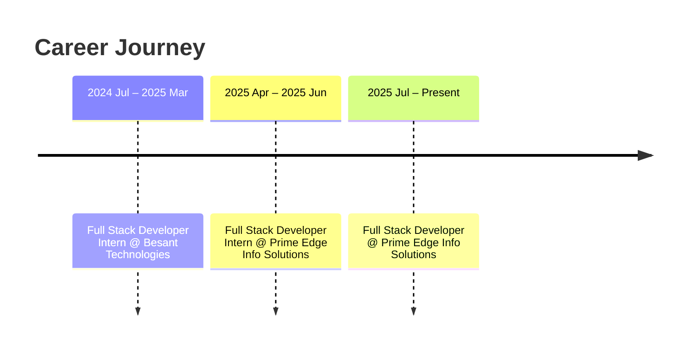

<div align="center">


<a href="https://www.linkedin.com/in/adaikalraj">
  
</a>
<a href="https://github.com/AdaikalrajS">
  
</a>
<a href="mailto:adaikalraj2003@gmail.com">
  
</a>
<a href="tel:+918531936118">
  
</a>


</div>

<br/>

## 🚀 About Me

```python
class FullStackDeveloper:
    def __init__(self):
        self.name = "Adaikalraj S"
        self.role = "Full Stack Developer"
        self.company = "Prime Edge Info Solutions Pvt Ltd"
        self.experience = "1+ year"
        self.stack = ["Java", "Spring Boot", "React JS", "MySQL", "Python", "AWS"]
        self.location = "Chennai, India"
        self.currently_learning = "Cloud-native architecture & CI/CD pipelines"

    def focus(self):
        return "Delivering business-focused, scalable software solutions 🎯"

me = FullStackDeveloper()
print(me.focus())
```

<table>
<tr>
<td width="60%" valign="top">

🔭 Currently building scalable web apps at **Prime Edge Info Solutions Pvt Ltd**
🛠️ Designed and integrated **20+ RESTful APIs** improving frontend–backend efficiency
⚡ Cut duplicate React code by **30%** through reusable component architecture
🐞 Reduced production issues by **25%** via debugging, testing & code reviews
☁️ Comfortable deploying and managing apps on **AWS EC2 / S3**
📊 Skilled in **Advanced Excel** — Pivot Tables, VLOOKUP, XLOOKUP, Dashboards
🌱 Strong believer in **Agile, SDLC,** and clean Git workflows

</td>
<td width="40%" valign="top" align="center">


</td>
</tr>
</table>

<br/>

## 🧰 Tech Stack

<div align="center">

### Languages


### Frontend


### Backend

<br/>


### Database


### Cloud & DevOps


### Tools & Productivity


</div>

<br/>

## 💼 Experience Timeline



<details>
<summary><b>🟦 Full Stack Developer — Prime Edge Info Solutions Pvt Ltd (Jul 2025 – Present)</b></summary>
<br/>

- Engineered scalable web applications using React JS, Spring Boot, and MySQL
- Designed and integrated **20+ RESTful APIs**, improving frontend-backend communication
- Optimized reusable React components, cutting duplicate code by **30%**
- Delivered responsive UIs across desktop, tablet, and mobile platforms
- Reduced production issues by **25%** through debugging, testing, and code reviews
- Participated in Agile sprint planning, release management & production support
- Assisted in deploying applications on **AWS EC2** environments

</details>

<details>
<summary><b>🟩 Full Stack Developer Intern — Prime Edge Info Solutions Pvt Ltd (Apr 2025 – Jun 2025)</b></summary>
<br/>

- Built responsive React JS interfaces integrated with dynamic REST API data
- Validated **50+ API test cases** using Postman for reliability and functionality
- Established reusable component architecture, improving development efficiency
- Resolved UI defects and improved cross-browser compatibility
- Collaborated with senior developers on business requirements & feature enhancements
- Contributed to Git workflows — branching, pull requests, code integration

</details>

<details>
<summary><b>🟨 Full Stack Developer Intern — Besant Technologies (Jul 2024 – Mar 2025)</b></summary>
<br/>

- Created dynamic, responsive web pages using HTML5, CSS3, JavaScript, React JS
- Engineered Java Spring Boot backend modules supporting CRUD operations
- Designed relational database schemas and executed complex MySQL queries
- Participated in technical discussions and code reviews following industry standards
- Delivered project milestones while adhering to SDLC and Agile practices

</details>

<br/>

## 🛠️ Featured Projects

<table>
<tr>
<td width="50%" valign="top">

### 🧑‍🔧 Field Engineers Management System
**Stack:** React JS · Google Apps Script

Full-stack web app to manage and monitor daily activities of **20+ field engineers**, with live dashboards and automated reporting.

- 🔄 Real-time sync via Google Sheets integration
- ⏱️ Cut manual reporting effort by **~40%**
- 📊 Interactive dashboards with live task tracking
- ✅ Form validation & error handling for data accuracy

 

</td>
<td width="50%" valign="top">

### 📚 Bookstore Application
**Stack:** Java · Spring Boot · MySQL

RESTful CRUD API system managing inventory for **1000+ book records** with clean layered architecture.

- 🏗️ Controller–Service–Repository architecture
- ⚙️ Hibernate ORM + Spring Data JPA
- 🗄️ Normalized MySQL schema for performance
- 🧪 **25+ endpoints** tested & validated via Postman

  

</td>
</tr>
<tr>
<td width="50%" valign="top">

### 👗 Trends Dress Collections — E-Commerce
**Stack:** React JS

A responsive e-commerce storefront with **15+ product pages**, category filtering, and a live shopping cart.

- 🛒 Real-time cart state management
- 🔍 Category filtering & search functionality
- 🧭 Seamless navigation via React Router
- 📱 Flexbox/Grid-based mobile responsiveness

 

</td>
<td width="50%" valign="top">

### ☕ Outstanding Grand Coffee — Business Website
**Stack:** HTML · CSS · JavaScript

A responsive business website built to boost online brand visibility with smooth, interactive UI.

- 🎨 Dynamic UI components & smooth navigation
- 🚀 Optimized performance via image compression
- 📱 Mobile-friendly, engagement-focused design

  

</td>
</tr>
</table>

<br/>

## 🎓 Education

<table>
<tr>
<td>

**Bachelor of Engineering — Electrical & Electronics Engineering**
Kongunadu College of Engineering and Technology, Thottiam
`CGPA: 8.13 / 10.0` &nbsp;|&nbsp; Aug 2020 – May 2024

</td>
</tr>
</table>

## 📜 Certifications

<div align="center">


</div>

<br/>

## 📊 GitHub Stats

<div align="center">


</div>

<br/>

## 📫 Let's Connect

<div align="center">

<a href="https://www.linkedin.com/in/adaikalraj">
  
</a>
<a href="https://github.com/AdaikalrajS">
  
</a>
<a href="mailto:adaikalraj2003@gmail.com">
  
</a>

<br/><br/>


</div>


